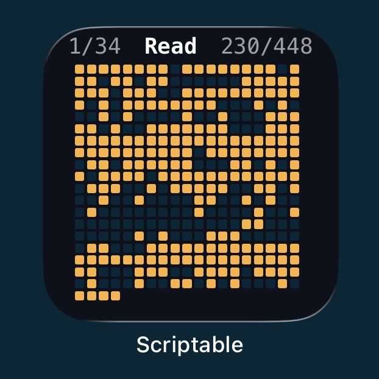
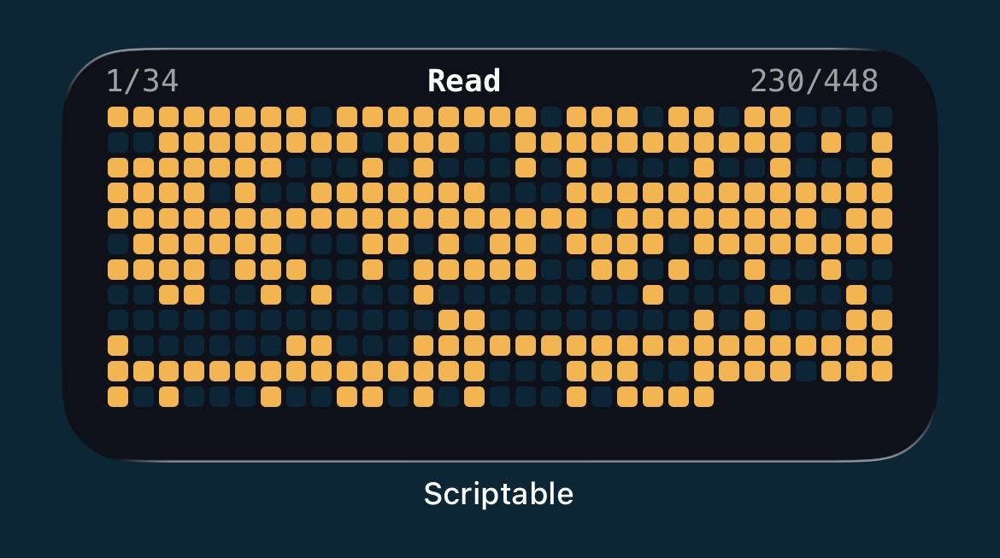
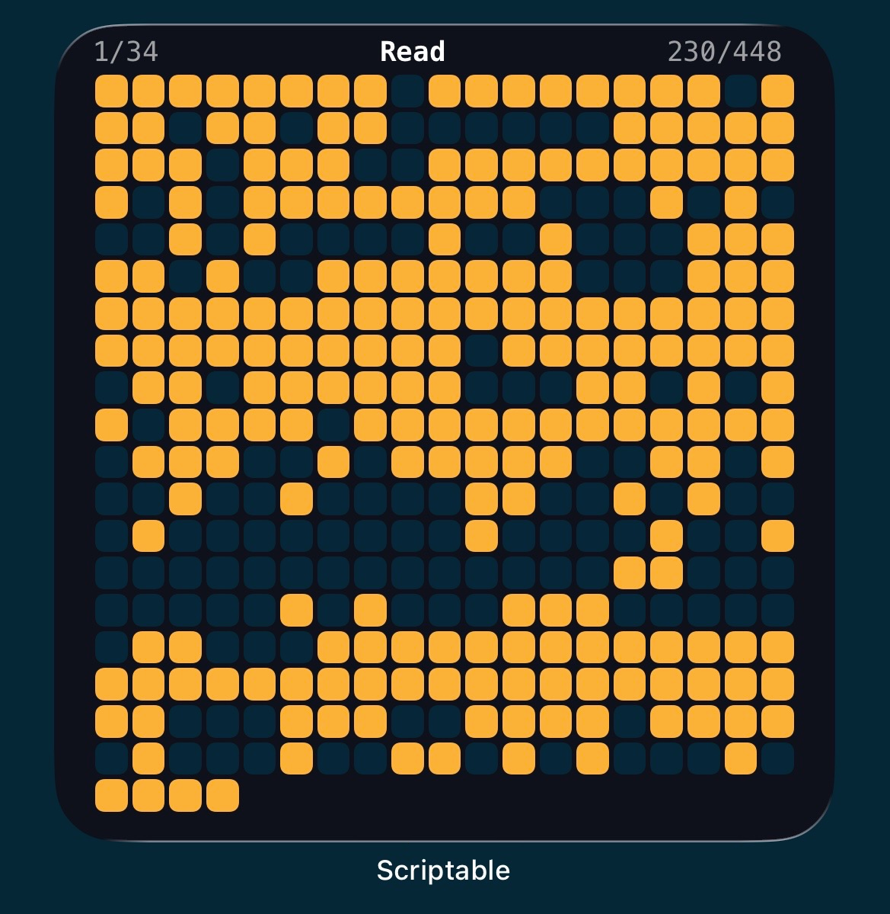
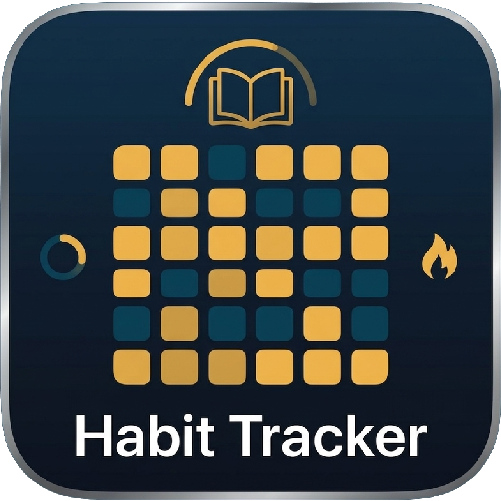

# Scriptable - Heatmap habit tracker with streak
A minimalist iOS habit tracker widget built for [Scriptable](https://scriptable.app). Tracks a single habit over a custom date range, displays progress as a grid of colored squares, featuring a streak counter, a tracker for the total number of completed habits versus the total planned and saves everything automatically to **iCloud Drive** — so your data syncs across all your devices without any extra setup.

<p align="center" style="flex; justify-items: center; align-items: center;">
  
  
  
</p>

What makes it especially motivating is the **streak system**: seeing your current streak grow day after day creates a strong visual incentive to stay consistent, while the best streak gives you a clear goal to beat. The value on the top left shows your **current streak / best streak**, while the value on the top right shows **completed days / total elapsed days**.

<p align="center" style="flex; justify-items: center; align-items: center;">
  
</p>

## Features
- Supports **small**, **medium**, and **large** widget sizes
- Squares auto-size to fill all available space on any device
- Tracks current streak, best streak, and total progress — designed to **encourage consistency through streak building**
- Saves data to **iCloud Drive** as a plain JSON file — syncs automatically across all your devices
- Tap the script to log or un-log today

## Installation
1. Install [Scriptable](https://apps.apple.com/app/scriptable/id1405459188) from the App Store
2. Copy the contents of `HabitTracker.js` into a new Scriptable script
3. Configure the **User Configuration** section at the top of the script (see below)
4. Add a Scriptable widget to your Home Screen, tap it to **Edit Widget**, then set **Script** to your newly created script and **When Interacting** to Run Script.

## Configuration
All user-facing settings are at the top of the script.

#### Habit settings
- `HABIT_NAME` → Name displayed in the widget header  
- `FOLDER_NAME` → Folder created inside `iCloud Drive / Scriptable / <FOLDER_NAME>` where data is stored  
- `YEAR` → Year in which the habit takes place  
- `START_DATE` / `END_DATE` → Define the start and end dates of the habit (months are 0-indexed)  
- `USER_DATE_FORMAT` → Date format used as keys in the JSON data file


> **Data file:** the script automatically creates a JSON file named `<HABIT_NAME> <YEAR>.json`
> inside `iCloud Drive > Scriptable > <FOLDER_NAME>`.

#### Colors
It is also possible to customize all widget colors. The main options are:

- `BACKGROUND_COLOR` → Widget background color
- `GRID_COLOR_FILLED` → Color for completed days  
- `GRID_COLOR_MISSED` → Color for past days where the habit was not completed  
- `GRID_COLOR_TODAY` → Color used to highlight the current day (not yet logged)  
- `GRID_COLOR_UNFILLED` → Color for future days not yet reached

#### Widget sizes
The widget sizes are pre-set for **iPhone 13**. If you use a different device, update these values by checking the correct widget dimensions on [developer.apple.com](https://developer.apple.com/design/human-interface-guidelines/widgets#Specifications:~:text=RelevanceKit%2E-,Specifications,guidance).

```js
// Pre-set for iPhone 13
const DEVICE_WIDGET_SIZES = {
  small:  { w: 158, h: 158 },
  medium: { w: 348, h: 158 },
  large:  { w: 348, h: 354 },
};
```

## Usage
It is possible to:

- **Log today**: tap the widget to mark today as done  
- **Un-log today**: tap the script again — a confirmation dialog will appear  

On the left and right sides of the title, the following values are displayed:

- `[ current streak / best streak ]` → shows your current consecutive days and your all-time best streak  
- `[ completed days / elapsed days ]` → shows how many days you have completed out of the total days since the start date

#### Data format
The data file is plain JSON — one entry per day:

```json
{
  "24/12/2025": true,
  "25/12/2025": false,
  "26/12/2025": true
}
```

`true` = completed, `false` = not completed (or not yet logged for today).

## Info
This project was created based on my own needs, without specific expectations. I tend to improve it over time whenever I notice issues or areas that can be refined.

## Contribution
If you'd like to contribute to Bloky, please follow these steps:
- Fork the repository;
- Create a new branch (```git checkout -b feature/YourFeatureName```);
- Commit your changes (```git commit -m 'Add some feature'```);
- Push to the branch (```git push origin feature/YourFeatureName```);
- Open a pull request.

## License
This project is licensed under the MIT License. See the LICENSE file for details.